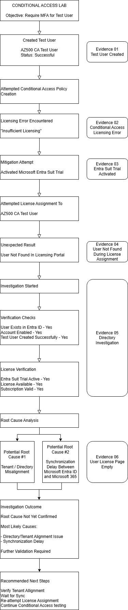

# Lab 05 – Conditional Access and MFA

## Objective

Create and validate a Microsoft Entra Conditional Access policy that requires multifactor authentication for a dedicated test user.

## Scenario

A test user requires access to Microsoft Azure Management. To improve identity security, a Conditional Access policy will be configured to require MFA before access is granted.

This lab also documents real-world troubleshooting performed during implementation, including licensing requirements, user visibility issues and tenant alignment investigation.

## Azure Services Used

- Microsoft Entra ID
- Conditional Access
- Microsoft Entra Suite Trial
- Microsoft 365 Admin Center
- Multifactor Authentication
- Sign-in Logs

---

## Phase 1 – Initial Setup and Issue Identification

A dedicated test user named `AZ500 CA Test User` was created for the Conditional Access lab.

When attempting to create a Conditional Access policy, the Conditional Access page showed that the tenant did not have sufficient licensing to use the feature.

Conditional Access required Microsoft Entra Premium licensing. To resolve this, a Microsoft Entra Suite trial subscription was activated.

---

## Challenge Encountered

After activating the Microsoft Entra Suite trial, an attempt was made to assign the license to the original test user.

However, the test user could not be found in the Microsoft 365 Admin Center license assignment interface.

Further investigation showed that there were different accounts and tenant domains involved during the lab:

- The original test user was created under one tenant/domain.
- The Microsoft Entra Suite trial appeared under another tenant/domain.

This created a possible tenant alignment issue.

---

## Troubleshooting Performed

1. Verified that the test user was successfully created in Microsoft Entra ID.
2. Confirmed that the test user account was enabled.
3. Attempted to access Conditional Access.
4. Identified the Microsoft Entra Premium licensing requirement.
5. Activated the Microsoft Entra Suite trial.
6. Attempted to assign the license to the test user.
7. Confirmed that the test user did not appear in the licensing assignment picker.
8. Checked the user license page and confirmed no license was assigned.
9. Investigated account and directory relationships.
10. Identified possible tenant/directory misalignment or Microsoft 365 synchronization delay.

---

## Troubleshooting Workflow

The following diagram documents the investigation process.

---

## Root Cause Analysis

The exact root cause was not fully confirmed at this stage.

The most likely contributing factors were:

| Potential Root Cause | Description |
|---|---|
| Tenant / Directory Misalignment | The test user and Microsoft Entra Suite trial appeared to be associated with different tenant domains. |
| Synchronization Delay | The newly created user may not have fully synchronized from Microsoft Entra ID to Microsoft 365 licensing services. |

---

## Investigation Outcome

The investigation showed that Conditional Access implementation depends not only on policy configuration, but also on licensing availability, tenant alignment, user provisioning and Microsoft 365 service synchronization.

To continue the lab safely, the next step is to create a new test user inside the same tenant where the Microsoft Entra Suite trial subscription exists.

---

## Evidence Captured – Troubleshooting Phase

Screenshots are stored in the `screenshots` folder.

- `01-test-user-created.png`
- `02-conditional-access-license-required.png`
- `03-entra-suite-trial-activated.png`
- `04-license-assignment-user-not-found.png`
- `05-account-directory-investigation.png`
- `06-user-license-page-empty.png`
- `07-conditional-access-lab-troubleshooting.png`

---

## Lessons Learned

- Conditional Access requires Microsoft Entra Premium licensing.
- Microsoft cloud security features can depend on licensing and tenant configuration.
- User creation in Microsoft Entra ID does not always immediately guarantee visibility in Microsoft 365 licensing services.
- Tenant alignment is important when assigning licenses and implementing identity security controls.
- Troubleshooting and evidence collection are important parts of security implementation work.

---

## Phase 2 – Remediation Plan

To continue the lab, a new test user will be created in the same tenant where the Microsoft Entra Suite trial subscription was activated.

The new test user will then be assigned a Microsoft Entra Suite license and used to complete the Conditional Access MFA policy implementation.

Planned remediation steps:

1. Create a new test user in the licensed tenant.
2. Assign Microsoft Entra Suite license to the new test user.
3. Confirm license assignment.
4. Create Conditional Access policy.
5. Scope the policy to the new test user only.
6. Require MFA for Microsoft Azure Management.
7. Test sign-in behaviour.
8. Validate Conditional Access result in sign-in logs.