# Lab 05 – Conditional Access and MFA

## Objective

Implement and validate a Microsoft Entra Conditional Access policy that requires Multifactor Authentication (MFA) for a dedicated test user, while documenting the end-to-end deployment, troubleshooting, validation and remediation process.

## Lab Workflow

The following workflow summarizes the implementation process.

1. Create test user
2. Identify Conditional Access licensing requirement
3. Activate Microsoft Entra Suite trial
4. Troubleshoot tenant alignment issue
5. Create licensed test user
6. Assign license
7. Create Conditional Access policy
8. Validate using What If tool
9. Resolve Security Defaults conflict
10. Enable policy
11. Complete MFA registration
12. Validate sign-in logs
13. Confirm policy enforcement

## Scenario

A dedicated test user was created to access Azure administrative resources. To improve identity security and align with Zero Trust principles, a Conditional Access policy was implemented to require MFA before access to administrative resources is granted.

During implementation, several real-world challenges were encountered, including licensing requirements, tenant alignment issues, user visibility problems and Security Defaults conflicts. These issues were investigated and documented as part of the lab.

## Azure Services Used

- Microsoft Entra ID
- Conditional Access
- Microsoft Entra Suite Trial
- Microsoft 365 Admin Center
- Multifactor Authentication (MFA)
- Microsoft Entra Sign-in Logs
- What If Policy Evaluation Tool

---

## Phase 1 – Initial Setup and Issue Identification

A dedicated test user named `AZ500 CA Test User` was created for the Conditional Access implementation.

While attempting to create the Conditional Access policy, Microsoft Entra displayed a licensing requirement indicating that the tenant did not have sufficient licensing to use Conditional Access.

To satisfy this requirement, a Microsoft Entra Suite trial subscription was activated.

---

## Challenge Encountered

Following activation of the Microsoft Entra Suite trial, an attempt was made to assign the license to the original test user.

Unexpectedly, the user could not be located within the Microsoft 365 Admin Center license assignment interface.

Further investigation identified that different tenant domains were involved during the lab implementation process.

This introduced a potential tenant alignment issue between:

- The original test user account.
- The tenant hosting the Microsoft Entra Suite trial subscription.

---

## Troubleshooting Activities Performed

The following troubleshooting activities were completed:

1. Verified successful creation of the test user in Microsoft Entra ID.
2. Confirmed the user account was enabled.
3. Attempted Conditional Access configuration.
4. Identified Microsoft Entra Premium licensing requirements.
5. Activated Microsoft Entra Suite trial licensing.
6. Attempted license assignment.
7. Confirmed the user did not appear in the licensing assignment interface.
8. Reviewed user licensing information.
9. Investigated account and tenant relationships.
10. Performed tenant alignment validation.
11. Identified potential tenant mismatch and synchronization dependencies.

---

## Troubleshooting Workflow

The troubleshooting process is documented in the attached investigation flowchart.

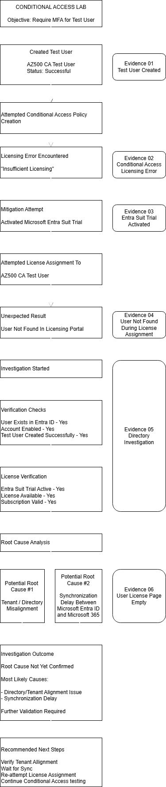

The investigation began after Conditional Access licensing requirements were identified during policy creation.

The troubleshooting process focused on validating:

- Test user creation
- Licensing availability
- License assignment
- Tenant alignment
- Directory synchronization
- Conditional Access prerequisites

The investigation identified that the original test user and the Microsoft Entra Suite trial subscription were likely associated with different tenant contexts, preventing successful license assignment.

---

## Root Cause Analysis

Although a single definitive root cause could not be confirmed, the investigation identified two likely contributing factors.

| Potential Root Cause | Description |
|---|---|
| Tenant / Directory Misalignment | The original test user and Microsoft Entra Suite trial subscription were associated with different tenant contexts. |
| Synchronization Delay | Microsoft Entra ID and Microsoft 365 licensing services may not have completed synchronization when license assignment was attempted. |

---

## Investigation Outcome

The investigation highlighted that successful Conditional Access implementation depends on more than policy creation alone.

Key dependencies include:

- Licensing availability
- Correct tenant alignment
- User provisioning
- Microsoft 365 synchronization
- Identity administration

To continue the implementation, a new test user was created within the same tenant that hosted the Microsoft Entra Suite subscription.

---

# Phase 2 – Correct Tenant Selection and User Recreation

Following the tenant alignment investigation, the correct Microsoft Entra tenant associated with the Microsoft Entra Suite trial subscription was identified and selected.

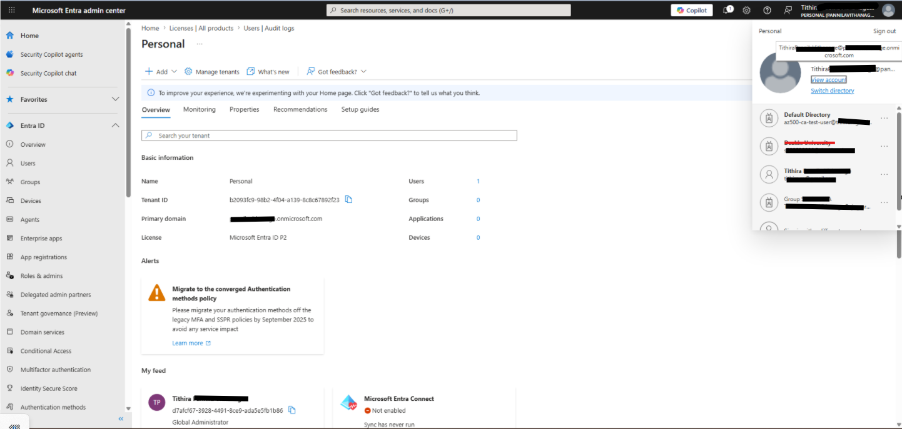

A new test user was created within the licensed tenant to ensure licensing and Conditional Access features could be applied correctly.

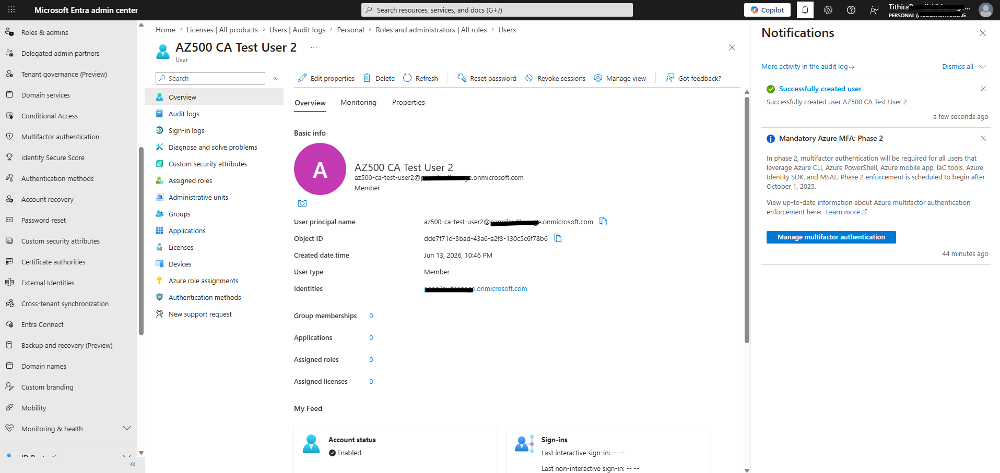

The Microsoft Entra Suite license was then successfully assigned.

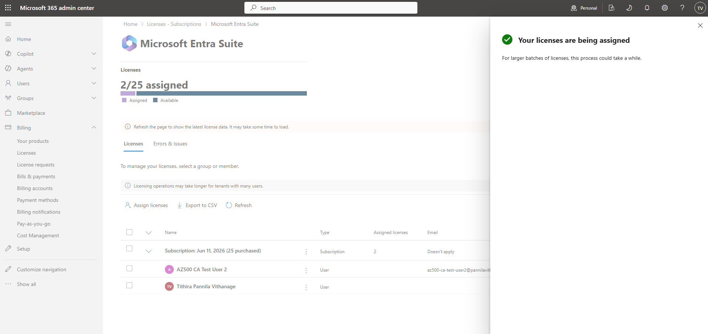

License assignment was verified through the user licensing page.

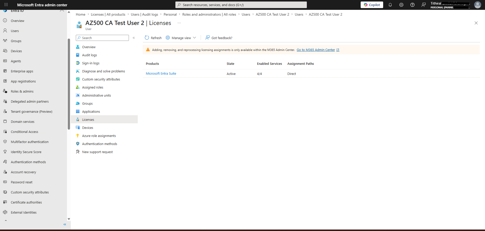

---

# Phase 3 – Conditional Access Policy Configuration

A Conditional Access policy named:

**CA-LAB-Require-MFA-Test-User**

was created.

## Configuration Summary

| Setting | Value |
|----------|----------|
| Users | Specific Test User |
| Target Resource | Microsoft Admin Portals |
| Grant Control | Require Multifactor Authentication |
| Conditions | None |
| Session Controls | None |
| Initial Deployment Mode | Report-only |

---

### User Assignment

The dedicated test user was selected.

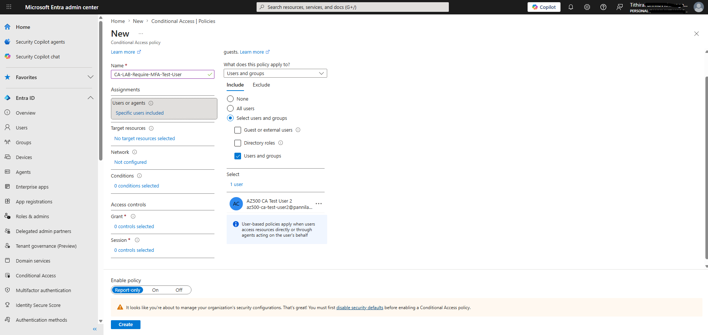

---

### Target Resource Selection

The policy was configured to protect Microsoft administrative portals.

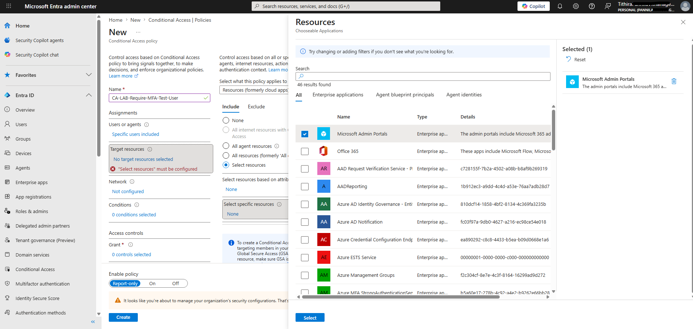

---

### Grant Control Configuration

The policy was configured to require Multifactor Authentication.

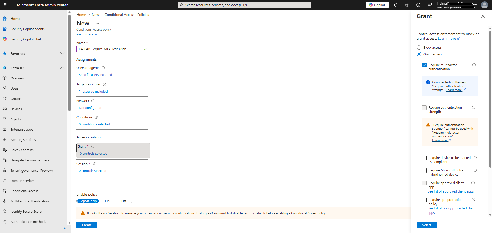

---

### Initial Report-Only Deployment

The policy was initially deployed in Report-only mode to safely validate its impact.

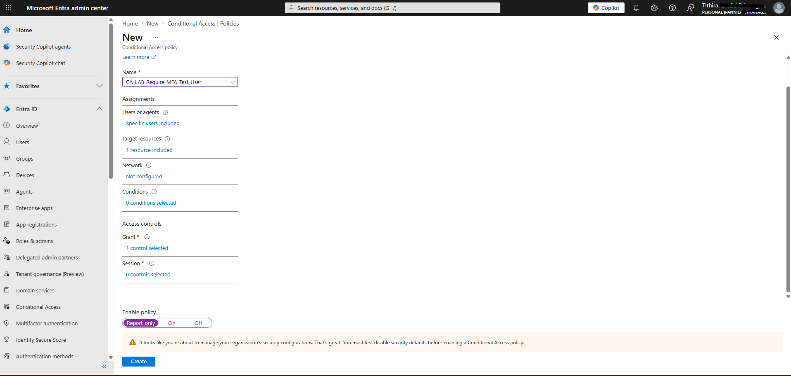

---

# Phase 4 – Policy Validation Using What If Tool

The Microsoft Entra What If tool was used to simulate a sign-in attempt and evaluate Conditional Access policy behavior before enforcement.

## What If Configuration

| Setting | Value |
|----------|----------|
| User | AZ500 CA Test User 2 |
| Cloud Application | Azure Resource Manager |
| Device Platform | Windows |
| Client Application | Browser |

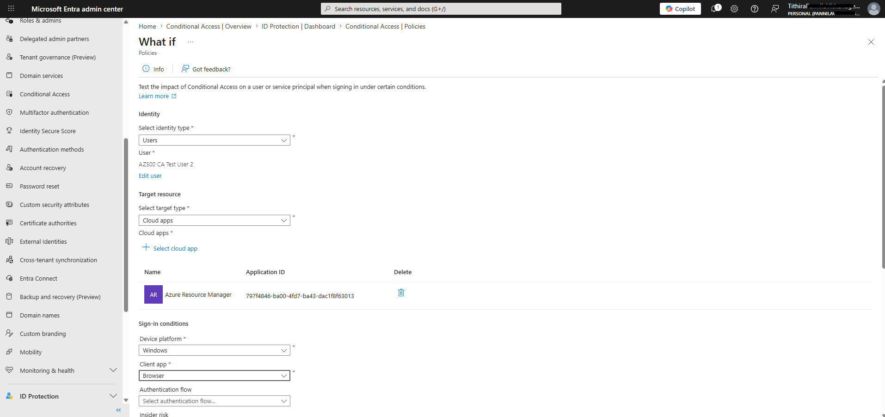

---

### What If Results

The simulation confirmed that the Conditional Access policy would apply to the selected user.

The evaluation identified:

- Policy matched
- MFA required
- Policy state = Report-only

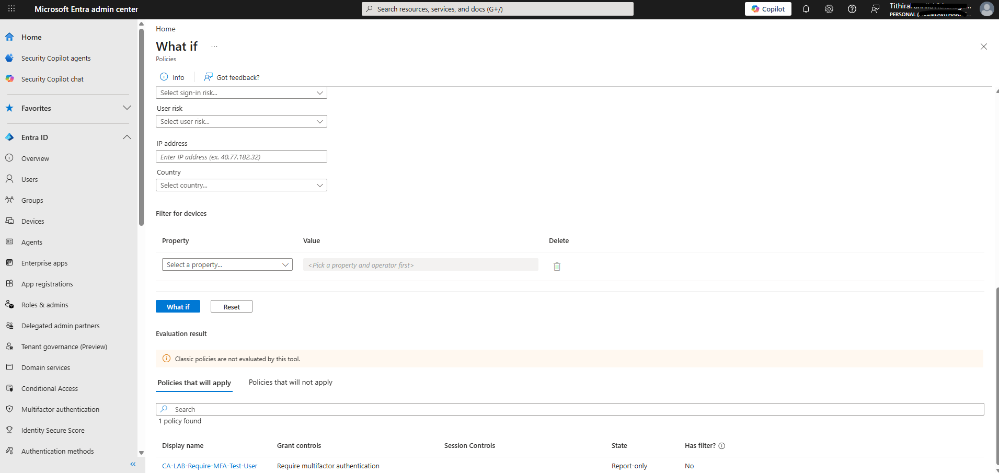

---

# Phase 5 – Security Defaults Conflict Resolution

When enabling the Conditional Access policy, Microsoft Entra displayed a conflict indicating that Security Defaults must be disabled before Conditional Access policies can be enforced.

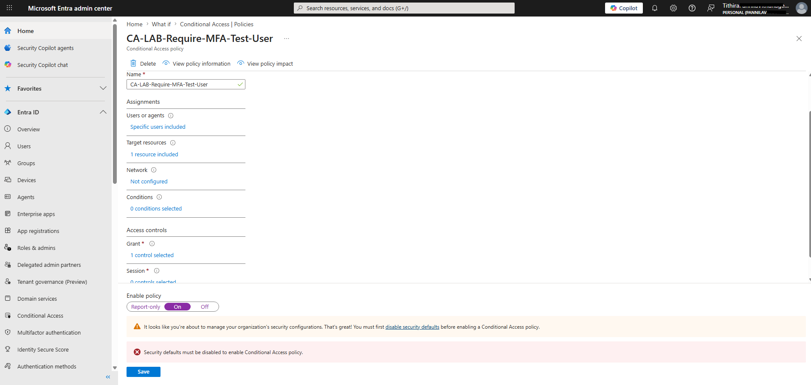

This behavior is expected because:

- Security Defaults already enforce baseline identity protection controls.
- Conditional Access provides granular policy-based controls.
- Both mechanisms cannot be actively enforced simultaneously.

To proceed with Conditional Access testing, Security Defaults were disabled.

Reason selected:

**My organization is planning to use Conditional Access.**

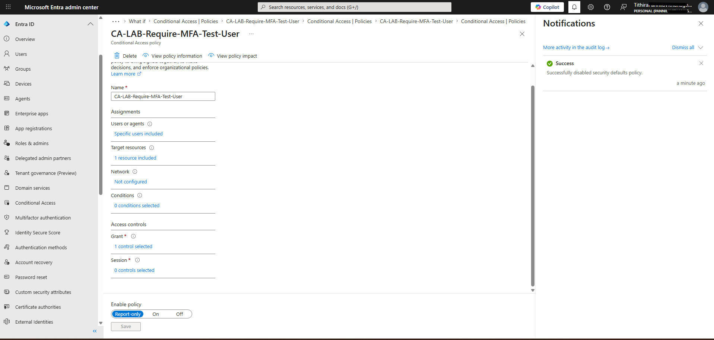

---

# Phase 6 – Conditional Access Policy Enforcement

Following Security Defaults remediation, the Conditional Access policy was switched from Report-only mode to On.

The policy was then saved and enabled successfully.

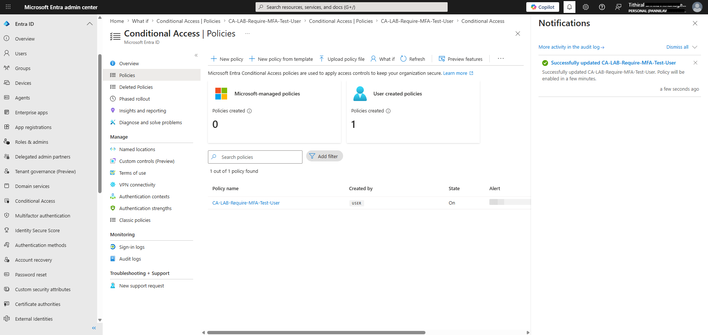

---

# Phase 7 – MFA Validation

The test user signed in and was prompted to complete Multifactor Authentication registration.

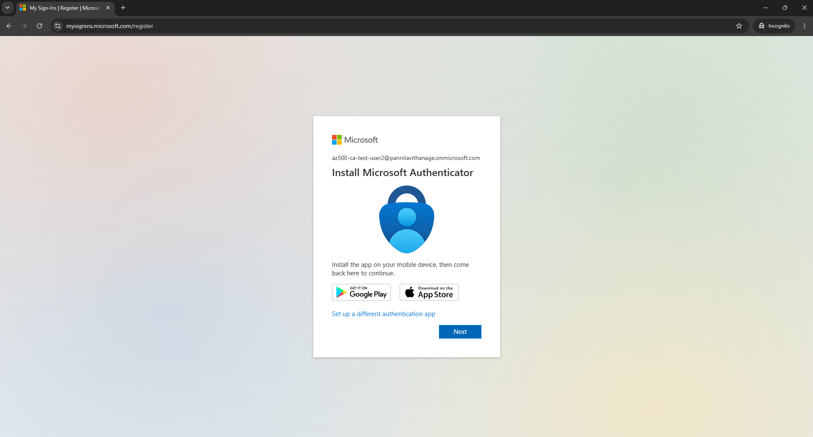

The MFA registration process was completed successfully.

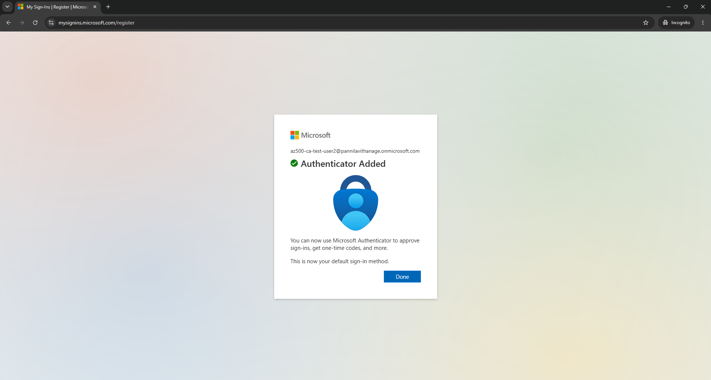

---

# Phase 8 – Validation Through Sign-In Logs

Microsoft Entra sign-in logs were reviewed to validate authentication activity.

The logs confirmed:

- Successful authentication
- MFA challenge performed
- Conditional Access evaluation completed

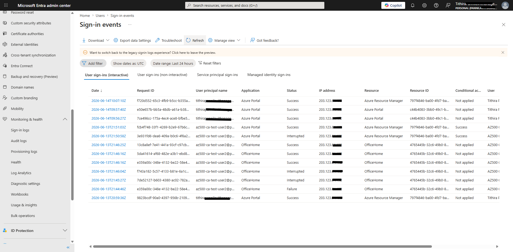

---

# Phase 9 – Conditional Access Policy Verification

Final validation confirmed that the Conditional Access policy was applied successfully to the target user.

Policy outcomes verified:

- User targeted correctly
- Resource targeted correctly
- MFA enforced
- Policy evaluated successfully
- Sign-in completed after MFA

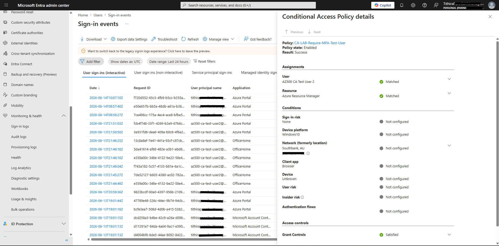

---

# Cleanup Activities

After successful validation, the lab environment was reviewed and cleanup activities were performed.

Activities included:

- Reviewing test accounts
- Reviewing policy configuration
- Documenting outcomes
- Preserving evidence for future reference

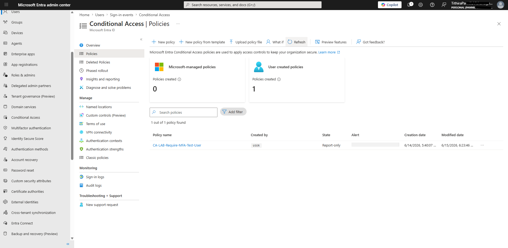

---

## Skills Demonstrated

- Microsoft Entra ID Administration
- Conditional Access Policy Management
- Multifactor Authentication (MFA)
- Identity and Access Management (IAM)
- Microsoft Entra Licensing
- Tenant Administration
- Security Troubleshooting
- Root Cause Analysis
- Authentication Monitoring
- Sign-In Log Analysis
- Zero Trust Security Controls

---

# Key Lessons Learned

This lab demonstrated that successful Conditional Access deployment requires more than policy creation.

Important dependencies include:

- Microsoft Entra Premium licensing
- Tenant and directory alignment
- User provisioning and synchronization
- Security Defaults configuration
- Policy validation using the What If tool
- MFA registration workflows
- Sign-in log analysis

The troubleshooting process highlighted the importance of methodical investigation and evidence-based validation when implementing identity security controls.

---

# Security Concepts Demonstrated

- Conditional Access
- Multifactor Authentication (MFA)
- Identity Protection
- Zero Trust Principles
- Microsoft Entra ID Administration
- Microsoft Entra Licensing
- Security Defaults
- Policy Simulation and Validation
- Authentication Monitoring
- Sign-In Log Analysis

---

# Outcome

Successfully implemented and validated a Microsoft Entra Conditional Access policy requiring Multifactor Authentication for a dedicated test user.

During implementation, multiple real-world issues were identified and resolved, including licensing prerequisites, tenant alignment challenges, user visibility issues and Security Defaults conflicts.

The final solution successfully enforced MFA, validated Conditional Access policy application through the What If tool and confirmed policy effectiveness using Microsoft Entra sign-in logs.

This lab demonstrates practical experience with identity security administration, Conditional Access deployment, troubleshooting methodology and Zero Trust access controls.